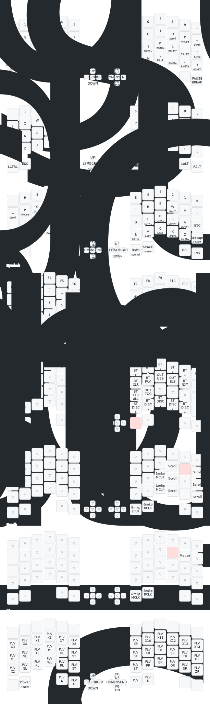

# Config for the DO52Pro

Based on
[filippor/kb_zmk_ps2_mouse_trackpoint_driver-zmk_config](
https://github.com/filippor/kb_zmk_ps2_mouse_trackpoint_driver-zmk_config) and
[kat1337/zmk-config-do52pro/](https://github.com/kat1337/zmk-config-do52pro/).

The DO52Pro is a cheap kit *with trackpoint!* available from AliExpress, you
can get it for around £30, which is an insanely good deal. With the Outemu
half-height Cherry MX stem compatible switches, and some low-profile keycaps (I
have the [XVX skyline keycaps](
https://www.xvxchannel.com/collections/low-profile-keycaps/products/xvx-skyline-137-key-low-profile-double-shot-keycap-set-8-colors),
the keycaps are the same height as the plastics, which is very pleasing.

## Keymap



## Build

See <https://zmk.dev/docs/development/local-toolchain/build-flash> for proper
instructions. I use something like

```sh
# ZMK is cloned into $BASE/zmk, this repo is at $BASE/zmk-config-do52pro

# In $BASE/zmk
west init -l --mf "$BASE/zmk-config-do52pro/config/west.yml" app/
west update

# Uncomment to enable USB logging
# LOG="-S zmk-usb-logging"

# In $BASE/zmk/app
west build \
  $LOG \
  -d build/settings_reset \
  -b "nice_nano_v2" \
  -- \
  -DSHIELD="settings_reset"

west build \
  $LOG \
  -d build/left \
  -b "nice_nano_v2" \
  -- \
  -DZMK_CONFIG="$BASE/zmk-config-do52pro/boards/shields/yk_do52pro" \
  -DSHIELD="yk_do52pro_left" \
  -DZMK_EXTRA_MODULES="$BASE/zmk-config-do52pro;$BASE/zmk/zmk-helpers;$BASE/zmk/kb_zmk_ps2_mouse_trackpoint_driver"

west build \
  $LOG \
  -d build/right \
  -b "nice_nano_v2" \
  -- \
  -DZMK_CONFIG="$BASE/zmk-config-do52pro/boards/shields/yk_do52pro" \
  -DSHIELD="yk_do52pro_right" \
  -DZMK_EXTRA_MODULES="$BASE/zmk-config-do52pro;$BASE/zmk/zmk-helpers;$BASE/zmk/kb_zmk_ps2_mouse_trackpoint_driver"
```

and flash with

```
# To have time to register after using it to send the bootloader key combo
sleep 10
cp build/left/zephyr/zmk.uf2 /run/media/rmk/DO52PRO_LH  &
cp build/right/zephyr/zmk.uf2 /run/media/rmk/DO52PRO_RH &
wait
```

## Bootloader update

This allows the boards to have a name like DO52PRO_LH/DO52PRO_RH which makes it
easier when flashing.

```sh
❯ cd Adafruit_nRF52_Bootloader/
❯ make \
  BOARD=do52pro \
  LEFT_HALF=1 \
  SERIAL=/dev/serial/by-id/usb-... \
  flash-dfu
❯ make \
  BOARD=do52pro \
  RIGHT_HALF=1 \
  SERIAL=/dev/serial/by-id/usb-... \
  flash-dfu
```
